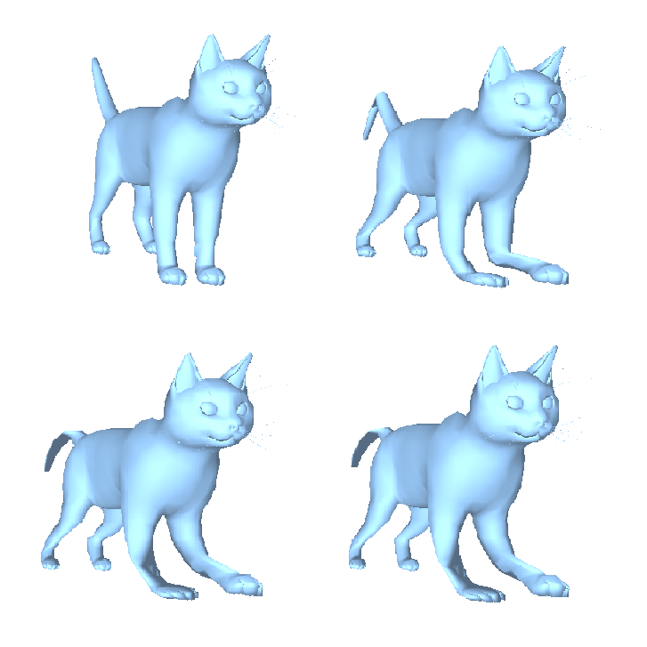

#EmbeddedDeformation

A c++ implementation of _Embedded Deformation for Shape Manipulation(Siggraph 2007)_.

###Dependency

* OpenGL 3.3

*  Eigen 3.3.4

* glm 0.9.8

* glfw 3.2.1

* glew 2.1.0

* Assimp

### To-do list

- [x] change the general architecture to [model <-> (a pointer to model)function(rotation/regularization/constraint)(function value/J/H) <-> solver]

- [x] read configure file - json format

- [x] add animation <-> ma = F_inner + F_outer <-> energy function

- [x] clean the code

- [ ] Hessian = const + J^T * J (E_reg/E_con: const / E_rot: J^T * J)

- [ ] cont: use SVD to accelerate

  ### 