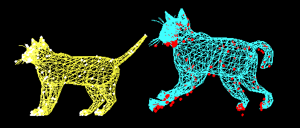

# EmbeddedDeformation

A c++ implementation of _Embedded Deformation for Shape Manipulation(Siggraph 2007)_.

### To-do list

- [x] change the general architecture to [model <-> (a pointer to model)function(rotation/regularization/constraint)(function value/J/H) <-> solver]

- [ ] read configure file - json format

- [ ] add animation <-> ma = F_inner + F_outer <-> energy function

- [ ] clean the code

- [ ] Hessian = const + J^T * J (E_reg/E_con: const / E_rot: J^T * J)

- [ ] cont: use SVD to accelerate

  ### Current result

  

  

  

  ### 